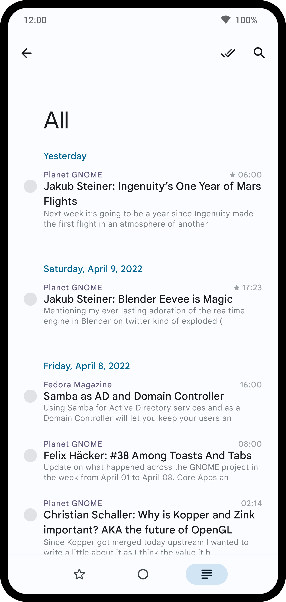
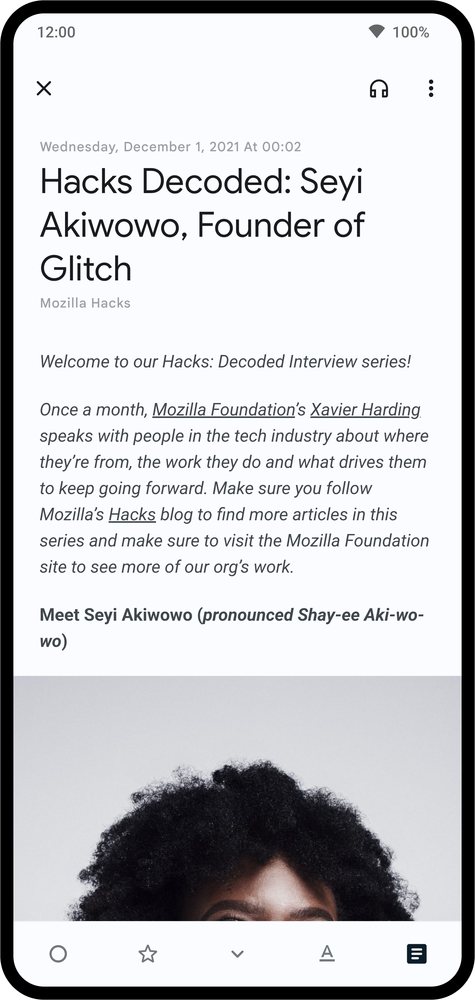

<div align="center">
    
</div>

<br>
<br>
<br>

<div align="center">
    
    <a target="_blank" href="https://github.com/Ashinch/ReadYou/releases">
        
    </a>
    
    <br>
    <a target="_blank" href="https://t.me/ReadYouApp">
        
    </a>
    <a target="_blank" href="https://www.figma.com/file/ViBW8GbUgkTMmK6a80h8X1/Read-You?node-id=7028%3A23673">
        
    </a>
</div>

<div align="center">
    <h1>Read You</h1>
    <p>Dies ist eine Kopie von <a href="https://reederapp.com/">Reeder</a>, um Android einen RSS-Reader ähnlich zu Reeder zu geben.</p>
    <p><a target="_blank" href="https://github.com/Ashinch/ReadYou/blob/main/README.md">English by DeepL</a>&nbsp;&nbsp;|&nbsp;&nbsp;
    Deutsch&nbsp;&nbsp;|&nbsp;&nbsp;<a target="_blank" href="https://github.com/Ashinch/ReadYou/blob/main/README-zh-CN.md">简体中文</a>&nbsp;&nbsp;|&nbsp;&nbsp;<a target="_blank" href="https://github.com/Ashinch/ReadYou/blob/main/README-zh-TW.md">繁體中文</a></p>
    <br/>
    <br/>
    
    
    
    
    
    <br/>
    <br/>
</div>

## Funktionen

**Read You** kombiniert die Interaktionslogik von Reeder mit dem Designstil von [Material Design 3 (You)] (https://m3.material.io/).

Nachfolgend sind die bisher erzielten Fortschritte und die Ziele aufgeführt, an denen in naher Zukunft gearbeitet werden soll:

-   [x] Lokal

    -   [x] Feed Links abonnieren
    -   [x] Aus OPML importieren
    -   [x] Artikel Synchronisation
    -   [x] Benachrichtigung über Aktualisierung eines Artikels
    -   [x] Gesamten Artikel abrufen
    -   [x] Filter ungelesen und markiert
    -   [x] Feed Gruppen
    -   [x] Lokalisierung
    -   [x] Als OPML exportieren
    -   [x] Suche nach Artikeln
    -   [ ] Präferenzeinstellungen
    -   [ ] APK veröffentlichen
    -   [ ] Widget
    -   [ ] ...

-   [ ] Fever API Unterstützung
-   [ ] Google Reader API Unterstützung
-   [ ] Inoreader API Unterstützung
-   [ ] ...

> Bei den oben genannten Funktionen handelt es sich nur um vorläufige Implementierungen, und es können noch unbekannte Probleme auftreten.

## Herunterladen

[](https://f-droid.org/packages/me.ash.reader/)

oder hole die APK aus dem [GitHub Releasebereich](https://github.com/Ashinch/ReadYou/releases).

## Übersetzen

<a target="_blank" href="https://weblate.bubu1.eu/engage/readyou/">

</a>

## Build

> Wenn Sie eine Vorschau der Read You App wollen, können Sie die **Vorschau-Version** der APK-Datei in [Telegram] (https://t.me/ReadYouApp) herunterladen.

**Read You** ist auf der Android nativen [Jetpack Compose](https://developer.android.com/jetpack/compose) Architektur implementiert.

1. Zuerst müssen Sie sich den Quellcode von **Read You** herunterladen.

    ```shell
    git clone https://github.com/Ashinch/ReadYou.git
    ```

2. Öffnen Sie es dann mit [Android Studio (neueste Version)] (https://developer.android.com/studio).

3. Wenn Sie auf die Schaltfläche `▶ Run` klicken, wird die App automatisch erstellt und ausgeführt.

    > Falls es zu Schwierigkeiten kommt, wähle bitte die Release version.

## Credits

-   [MusicYou](https://github.com/Kyant0/MusicYou)
-   [ParseRSS](https://github.com/muhrifqii/ParseRSS): [MIT](https://github.com/muhrifqii/ParseRSS/blob/master/LICENSE)
-   [Readability4J](https://github.com/dankito/Readability4J): [Apache License 2.0](https://github.com/dankito/Readability4J/blob/master/LICENSE)
-   [opml-parser](https://github.com/mdewilde/opml-parser): [Apache License 2.0](https://github.com/mdewilde/opml-parser/blob/master/LICENSE)
-   [compose-html](https://github.com/ireward/compose-html): [Apache License 2.0](https://github.com/ireward/compose-html/blob/main/LICENSE.txt)
-   （Noch zu verbessern）

## Lizenz

[GNU GPL v3.0](https://github.com/Ashinch/ReadYou/blob/main/LICENSE)
