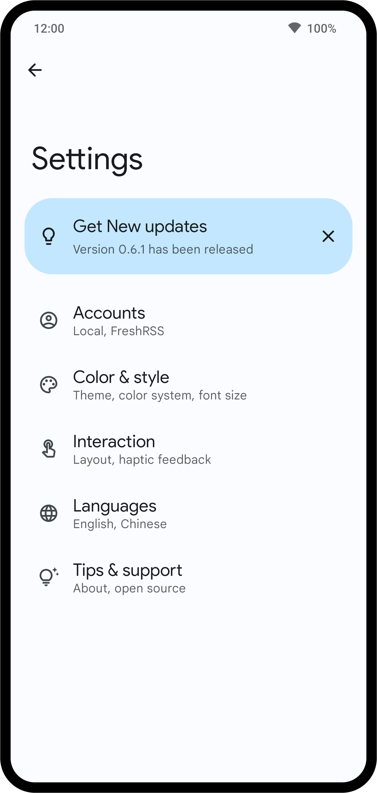

<div align="center">
    
</div>

<br>
<br>
<br>

<div align="center">
    
    
    
    <br>
    <a target="_blank" href="https://t.me/ReadYouApp">
        
    </a>
    <a target="_blank" href="https://www.figma.com/file/ViBW8GbUgkTMmK6a80h8X1/Read-You?node-id=7028%3A23673">
        
    </a>
</div>

<div align="center">
    <h1>Read You</h1>
    <p>This is a copy of  <a href="https://reederapp.com/">Reeder</a>, in order to give Android an RSS reader similar to Reeder.</p>
    <p>English by DeepL&nbsp;&nbsp;|&nbsp;&nbsp;
    <a target="_blank" href="https://github.com/Ashinch/ReadYou/blob/main/README-zh.md">简体中文</a></p>
    <br/>
    <br/>
    
    
    
    
    
    <br/>
    <br/>
</div>

## Features

**Read You** combines the interaction logic of Reeder with the design style of [Material Design 3 (You)](https://m3.material.io/).

The following are the progress made so far and the goals to be worked on in the near future:

-   [x] Local

    -   [x] Subscribe to Feed Links
    -   [x] Import from OPML
    -   [x] Article Sync
    -   [x] Article Update Notification
    -   [x] Parse Full Content
    -   [x] Filter Unread and Starred
    -   [x] Feed Grouping
    -   [x] Localization
    -   [x] Export as OPML
    -   [x] Search for Articles
    -   [ ] Preference Settings
    -   [ ] Release APK
    -   [ ] Widget
    -   [ ] ...

-   [ ] Fever API Support
-   [ ] Google Reader API Support
-   [ ] Inoreader API Support
-   [ ] ...

> The above features are only preliminary implementations and there may be unknown issues.

## Build

> If you want to preview the Read You app, you can get the **preview version** of the APK file in [Telegram](https://t.me/ReadYouApp).

**Read You** is implemented on Android's native [Jetpack Compose](https://developer.android.com/jetpack/compose) architecture.

1. First you need to get the source code of **Read You**.

    ```shell
    git clone https://github.com/Ashinch/ReadYou.git
    ```

2. Then open it via [Android Studio (latest version)](https://developer.android.com/studio).

3. When you click the `▶ Run` button, it will be built and run automatically.

    > In case of lag, please select Release version build.

## Credits

-   [MusicYou](https://github.com/Kyant0/MusicYou)
-   [ParseRSS](https://github.com/muhrifqii/ParseRSS): [MIT](https://github.com/muhrifqii/ParseRSS/blob/master/LICENSE)
-   [Readability4J](https://github.com/dankito/Readability4J): [Apache License 2.0](https://github.com/dankito/Readability4J/blob/master/LICENSE)
-   [opml-parser](https://github.com/mdewilde/opml-parser): [Apache License 2.0](https://github.com/mdewilde/opml-parser/blob/master/LICENSE)
-   [compose-html](https://github.com/ireward/compose-html): [Apache License 2.0](https://github.com/ireward/compose-html/blob/main/LICENSE.txt)
-   （To be improved）

## License

[GNU GPL v3.0](https://github.com/Ashinch/ReadYou/blob/main/LICENSE)
